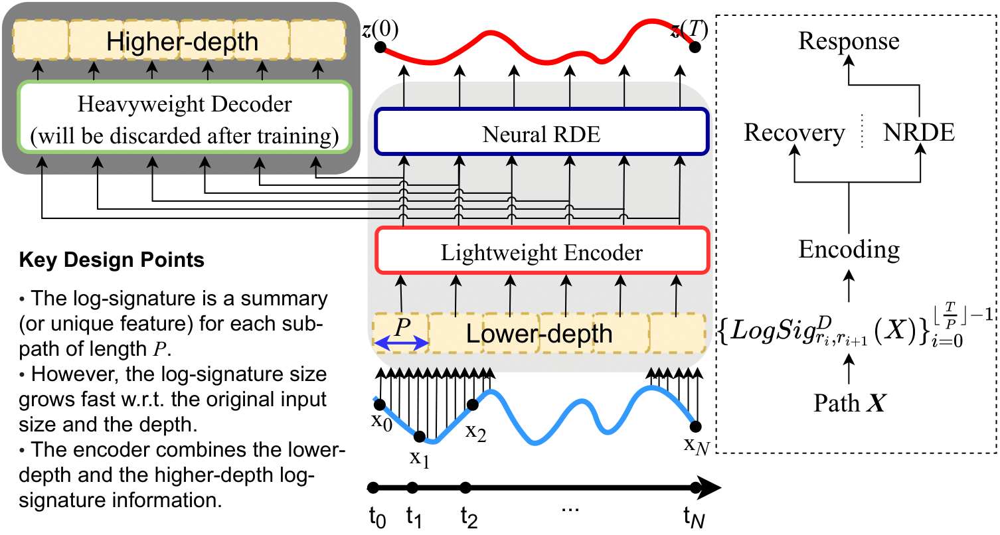

# LORD: Lower-Dimensional Embedding of Log-Signature in Neural Rough Differential Equations(ICLR 2022)


This is official code implementation for [this paper](https://openreview.net/forum?id=fCG75wd39ze).

## 1. Software Environment
1. python: 3.7.10
2. torch: 1.8.1+cu111
3. other package:
    ```
    pip install -r requirements.txt
    pip install signatory==1.2.0.1.4.0 --no-cache-dir --force-reinstall
    ```

## 2. Download and Unzip the Datasets
Download data.tar.gz from [this url](https://drive.google.com/file/d/1P2eklabDel0vA3DdA7ftcavBNiMztTt-/view?usp=sharing). Save the file in top level directory(_i.e._ LORD) and run the below command.
```
tar -zxvf data.tar.gz
```

## 3. Reproduce the Score of LORD and Baselines
You can experiment with all datasets. If you want to experiment with other parameters, you can change 'hyperparams.py' file in 'lord' directory.
1. Reproduce LORD's result
    ```
    cd lord
    python main.py --ds_name {DATA} --D1 {D1} --D2 {D2} --P {SUB-PATH LENGTH} --gpu {GPU}
    ```
    DATA: dataset, {EigenWorms, CounterMovementJump, SelfRegulationSCP2, BIDMC32HR, BIDMC32RR, BIDMC32RR}  
    D1, D2: lower-depth and higher depth(D1 < D2), {2,3}  
    SUB-PATH LENGTH: sub-path length
    GPU: gpu number to use
    
3. check the Result.  
    If you run `python check_score.py` in the LORD folder, you can check all your scores.
    
    Model size is printed in a terminal when training 

## Reference
\[1\] James Morrill, Cristopher Salvi, Patrick Kidger, James Foster, and Terry Lyons. Neural rough differential equations for long time series. 2021.  
\[2\] Sheo Yon Jhin, Heejoo Shin, Seoyoung Hong, Minju Jo, Solhee Park, and Noseong Park. Attentive
neural controlled differential equations for time-series classification and forecasting. In ICDM, 2021.
